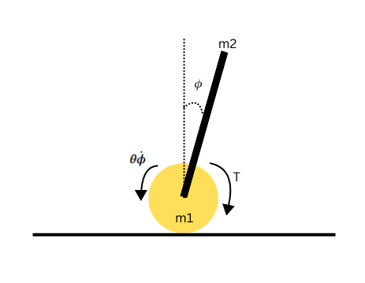

# Adaptive-Control-of-a-2D-Segway-Robot

This repository defines a systematic approach of solving a control problem of a 2D Segway robot using Lyapunov-based Adaptive Control. The idea of adaptive control is to control a system under uncertain conditions where some parameter $\theta$ of the system is unknown. 

In the case of a Segway robot this could be thought of as the friction coefficient at the pivot joint between the wheels and link. The dynamics of this system are given as:

$$ M \ddot{x} + C \ddot{\phi} cos(\phi) - C \dot{\phi}^2 sin(\phi) = \frac{T}{R}$$
$$ I \ddot{\phi} + C \ddot{x} cos(\phi) + \theta \dot{\phi} - C g sin(\phi) = - T$$

Unknown Coefficient of friciton: $\theta$

Here $M$, $I$, and $C$ are constant system parameters defined as:
$M = m_1 + m_2 +\frac{I_2}{R^2}$, $I = I_1 + m_1 (\frac{l}{2})^2$, and $C = m_1 \frac{l}{2}$; $m_1$, and $m_2$ are the masses of the wheel and the link respectively, $l$ is the link length, $g$ is gravitational constant, $R$ is the wheel radius, $I_2$ is the link inertia, $T$ is the torque input to the wheel, and $\theta$ is the unknown parameter that we shall handle using the adaptive control. A more elaborate detail of the dynamics can be found in the markdown "SegWay Dynamics.md".

## Matrix Representation

### State and Action Space

$$
S = [x, \dot{x}, \phi, \dot{\phi}],
$$

$$
a = \begin{bmatrix}
T \\
\end{bmatrix}.
$$

## Lyapunov Control
Now we define a variable \( e \), which we call the sliding surface. This will help us define all the states in a single variable and facilitate the implementation of the Lyapunov method with adaptive control.

$$
e = k_1 x + k_2 \dot{x} + k_3 \phi + k_4 \dot{\phi}
$$

Here, $k_1$, $k_2$, $k_3$, $k_4$ are tuneable parameters.

Our Goal is to drive $e$ to zero so that all the states are driven to zero.
If we define a Lyapunov function without considering the unknown parameter $\theta$, such as a simpler form:

$$
L = \frac{1}{2} e^2
$$

we would face challenges in achieving a strictly negative Lyapunov derivative due to the presence of the unknown friction coefficient $\theta$. The derivative of this simpler Lyapunov function is:

$$
\dot{L} = e \dot{e}
$$

Substituting the expression for $\dot{e}$:

$$
\dot{e} = k_1 \dot{x} + k_3 \dot{\phi} + v T + b \phi + c \theta \dot{\phi}
$$

we get:

$$
\dot{L} = e \left( k_1 \dot{x} + k_3 \dot{\phi} + v T + b \phi + c \theta \dot{\phi} \right)
$$

To make $\dot{L} \leq 0$, we might attempt to choose the control torque $T$ to cancel the known terms and make $\dot{L}$ negative, for example:

$$
v T = -p e - k_1 \dot{x} - k_3 \dot{\phi} - b \phi
$$

$$
T = \frac{-p e - k_1 \dot{x} - k_3 \dot{\phi} - b \phi}{v}
$$

Substituting this $T$ into $\dot{e}$:

$$
\dot{e} = -p e + c \theta \dot{\phi}
$$

Thus:

$$
\dot{L} = e (-p e + c \theta \dot{\phi}) = -p e^2 + e c \theta \dot{\phi}
$$

## Adaptive Lyapunov Control

The term $e c \theta \dot{\phi}$ introduces a problem: since $\theta$ is unknown, we cannot guarantee that $\dot{L}$ is strictly negative. Depending on the values of  $e$, $\dot{\phi}$, and $\theta$, the term  $e c \theta \dot{\phi}$ could be positive and potentially dominate $-p e^2$ , making  $\dot{L} > 0 $. This means the system’s stability cannot be ensured using this simple Lyapunov approach, as we lack a mechanism to handle the uncertainty in $\theta$.

In contrast, the adaptive control approach we implemented introduces an estimate $\hat{\theta}$ for the unknown $\theta$, and augments the Lyapunov function to include the estimation error:

$$
L = \frac{1}{2} e^2 + \frac{1}{2 \alpha} (\hat{\theta} - \theta)^2
$$

This allows us to define an update law for $\hat{\theta}$ that cancels the effect of the unknown $\theta$, resulting in a strictly negative Lyapunov derivative $\dot{L} = -p e^2 $, as shown later. This adaptive method effectively stabilizes both $x$ and $\phi$, driving them to zero, which would not have been possible with the simpler Lyapunov function due to the uncertainty in $\theta$.

we take the derivative of e:

$$ \dot{e} = k_1\dot{x} + k_2\ddot{x} + k_3\dot{\phi} + k_4\ddot{\phi} $$

the derivative of e can be defined in a simpler form by isolating the terms $T$, $\phi$ and $\theta\dot{\phi}$.

$$ \dot{e} = k_1\dot{x} + k_3\dot{\phi} + vT + b \phi + c \theta\dot{\phi} $$
where
$$v = \frac{k_2(I/R + Ccos\phi) + k_4(-Ccos\phi/R - M)}{MI - (Ccos\phi)^2}$$
$$b = \frac{k_2(IC\dot{\phi}^2 sin\phi - C^2gcos\phi sin\phi) + k_4(-C^2(\dot{\phi})^2cos\phi sin\phi + MCgsin\phi)}{MI - (Ccos\phi)^2}$$
$$c = \frac{k_2Ccos\phi - k_4M}{MI - (Ccos\phi)^2}$$

###  Adaptive Lyapunov Formulation

we define a Lyapunov function:

$$L = \frac{1}{2} e^2 + \frac{1}{2} (\hat{\theta} - \theta)^2$$

The derivative of this Lyapunov function is:

$$\dot{L} = e\dot{e} +(\hat{\theta} - \theta)\dot{\hat{\theta}}$$

Now Substituting $\dot{e}$ and grouping the terms involving $\theta$ together, also substituting the expressions for $\ddot{x}$, and $\ddot{\phi}$.
here we treat $\dot{e}$ differently by relpacing $\theta$ as an error term of the estimated $\hat{\theta}$ and $\theta$:

$\dot{e} = k_1\dot{x} + k_3\dot{\phi} + vT + b \phi + c ({\theta - \dot{\hat{\theta}}})\dot{\phi}$

$$\dot{L} = e(k_1\dot{x} + k_3\dot{\phi} + vT + b \phi + c \hat{\theta}\dot{\phi}) +ec(\theta - \hat{\theta})\dot{\phi} + (\theta- \hat{\theta})\dot{\hat{\theta}}$$

Now We want the part of our lyapunov derivative that has the state $e$ and control action $T$ to be $\leq-pe$, where $\p$ is a design parameter, this will ensure that our control action keeps the lyapunov derivative strictly negative and thus ensuring a stable system.
we choose the control action T as:

$$ T = \frac{-pe + k_1\dot{x} + k_3 \dot{\phi} + b \phi + c\hat{\theta} \dot{\phi}}{v}$$

Substituting this T into $\dot{L}$ we get:

$$\dot{L} = -pe^2 +ec(\theta - \hat{\theta})\dot{\phi} + (\theta- \hat{\theta})\dot{\hat{\theta}}$$

To get rid of the unknown $\theta$ term we propose an update law for $hat{\theta}$ as:

$$ \dot{\hat{\theta}} = -ec\dot{\phi}$$

This cancels the terms incluing $\theta$ and leaves us with a Lyapunov function derivative:

$$\dot{L} = -pe^2$$

which is strictly negative and satisfies our goal of driving the states to zero.

## Adaptive Control With Authority in Translational Velocity

Now we would like to extend our controller functionality by introducing velocity control. Previously, we only derived a controller that drove the states to zero, which meant that the positions and velocities were driven to zero value and the system was stabilized. However, for a Segway robot it makes sense to stabilize the link and move with a constant velocity, therefore, we shall derive such a controller that should track a certain desired velocity.

To track $\dot{x_{des}}$, we redefine the sliding surface to include a velocity tracking error:

$$ e = k_{vel}(\dot{x} - \dot{x_des}) + k_3{\phi} + k4\dot{\phi}$$

Here, $k_{vel}$ is a gain for velocity tracking and we removed $x$ terms from the sliding surface to focus on velocity rather than position.

The derivative of the sliding surface would be:

$$ \dot{e} = k_{vel}\ddot{x} + k_3\dot{\phi} + k4\ddot{\phi}$$

Now we define the same Lyapunov function as previously, and substitute the sliding surface expression and it's derivative:

$$L = \frac{1}{2} e^2 + \frac{1}{2} (\hat{\theta} - \theta)^2$$

The derivative of this Lyapunov function is:

$$\dot{L} = e( k_{vel}\ddot{x} + k_3\dot{\phi} + k4\ddot{\phi}) +(\hat{\theta} - \theta)\dot{\hat{\theta}}$$

Now grouping the terms involving $\theta$ together, also substituting the expressions for $\ddot{x}$, and $\ddot{\phi}$.

$$\dot{L} = e(k_1\dot{x} + k_3\dot{\phi} + vT + b \phi + c \hat{\theta}\dot{\phi}) +ec(\theta - \hat{\theta})\dot{\phi} + (\theta- \hat{\theta})\dot{\hat{\theta}}$$

Here the definition of the variables $v$, $c$, and $b$, should change since the defintion of the sliding surface has changed. we find the expressions for the se variables by substituting $\ddot{x}$, and $\ddot{\phi}$ into the sliding surface expression and seperate the terms involving $T$ and $\theta\dot{\phi}$:

$$v = \frac{k_2(I/R + Ccos\phi) + k_4(-Ccos\phi/R - M)}{MI - (Ccos\phi)^2}$$
$$b = \frac{k_{vel}(IC\dot{\phi}^2 sin\phi - C^2gcos\phi sin\phi) + k_4(-C^2(\dot{\phi})^2cos\phi sin\phi + MCgsin\phi)}{MI - (Ccos\phi)^2} + k_3 \dot{phi}$$
$$c = \frac{k_2Ccos\phi - k_4M}{MI - (Ccos\phi)^2}$$

Notice, only definition of $b$ changed which now includes the velocity tracking gain and an additional term. 

Now We want the part of our lyapunov derivative that has the state $e$ and control action $T$ to be $\leq-pe$, where $p$ is a design parameter, this will ensure that our control action keeps the lyapunov derivative strictly negative and thus ensuring a stable system.
we choose the control action T as:

$$ T = \frac{-pe + k_1\dot{x} + k_3 \dot{\phi} + b \phi + c\hat{\theta} \dot{\phi}}{v}$$

Substituting this T into $\dot{L}$ we get:

$$\dot{L} = -pe^2 +ec(\theta - \hat{\theta})\dot{\phi} + (\theta- \hat{\theta})\dot{\hat{\theta}}$$

To get rid of the unknown $\theta$ term we propose an update law for $hat{\theta}$ as:

$$ \dot{\hat{\theta}} = -ec\dot{\phi}$$

This cancels the terms incluing $\theta$ and leaves us with a Lyapunov function derivative:

$$\dot{L} = -pe^2$$

which is strictly negative and satisfies our goal of driving the states to zero.
