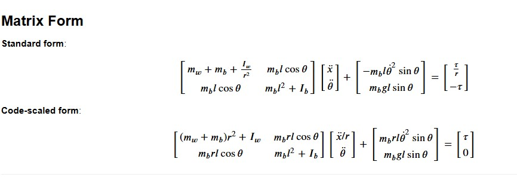

# 🦾 Segway Robot Dynamics via Lagrange Method

This document provides a detailed derivation of the dynamics of a 2D Segway robot using **Lagrangian mechanics**. The Segway is modeled as a two-wheeled inverted pendulum with a wheel assembly and a body pivoting above the wheel axle. The equations of motion are derived using the Lagrange method, which involves computing the kinetic and potential energies, forming the Lagrangian, and applying the Euler-Lagrange equations.

---

## System Description

The Segway robot consists of:

- **Wheels**: A combined wheel assembly with mass \(m_w\), radius \(r\), and moment of inertia \(I_w\).
- **Body**: A rigid body with mass \(m_b\), length \(L\), and center of mass at a distance \(l = L/2\) from the pivot (wheel axle). The moment of inertia of the body about its center of mass is \(I_b\).
- **Coordinates**: Generalized coordinates \(x\) and \(\theta\), where \(x\) is the horizontal position of the wheel axle and \(\theta = 0\) is upright.
- **Torque**: External torque \(\tau\) applied to the wheels.

---

## Parameters

- \(m_w = 1.0\) kg
- \(m_b = 5.0\) kg
- \(r = 0.1\) m
- \(L = 1.0\) m
- \(l = L/2 = 0.5\) m
- \(I_w = \frac{1}{2} m_w r^2\)
- \(I_b = \frac{1}{12} m_b L^2\)
- \(g = 9.81\) m/s²
- \(\tau\): Applied torque

---

## Lagrange Approach

### Step 1: Kinetic Energy

**Wheel kinetic energy**:
- Translational: $\(\frac{1}{2} m_w \dot{x}^2\)$
- Rotational: $\(\frac{1}{2} I_w \left( \frac{\dot{x}}{r} \right)^2\)$

**Total wheel**:  

$$
T_w = \frac{1}{2} m_w \dot{x}^2 + \frac{1}{2} I_w \left( \frac{\dot{x}}{r} \right)^2
$$

**Body kinetic energy**:  

$$
T_b = \frac{1}{2} m_b \left[ \dot{x}^2 + 2 \dot{x} l \dot{\theta} \cos \theta + l^2 \dot{\theta}^2 \right] + \frac{1}{2} I_b \dot{\theta}^2
$$

**Total kinetic energy**:  

$$
T = \frac{1}{2} \left( m_w + m_b + \frac{I_w}{r^2} \right) \dot{x}^2 + m_b l \dot{x} \dot{\theta} \cos \theta + \frac{1}{2} \left( m_b l^2 + I_b \right) \dot{\theta}^2
$$

---

### Step 2: Potential Energy

$$
V = m_{b} g l cos{\theta}
$$

### Step 3: Lagrangian

$$
\mathcal{L} = T - V = \frac{1}{2} \left( m_w + m_b + \frac{I_w}{r^2} \right) \dot{x}^2 + m_b l \dot{x} \dot{\theta} \cos \theta + \frac{1}{2} \left( m_b l^2 + I_b \right) \dot{\theta}^2 - m_b g l \cos \theta
$$

---

### Step 4: Euler-Lagrange Equations

**For** $x$:

$$
\left( m_w + m_b + \frac{I_w}{r^2} \right) \ddot{x} + m_b l \ddot{\theta} \cos \theta - m_b l \dot{\theta}^2 \sin \theta = \frac{\tau}{r}
$$

**For** $\theta$:

$$
m_b l \ddot{x} \cos \theta + \left( m_b l^2 + I_b \right) \ddot{\theta} + m_b g l \sin \theta = -\tau
$$

---

## Matrix Form

## Conclusion

The Lagrangian approach offers a clean and principled way to derive the coupled nonlinear dynamics of the Segway system. These equations are suitable for control design and simulation using tools like Python or MATLAB.
